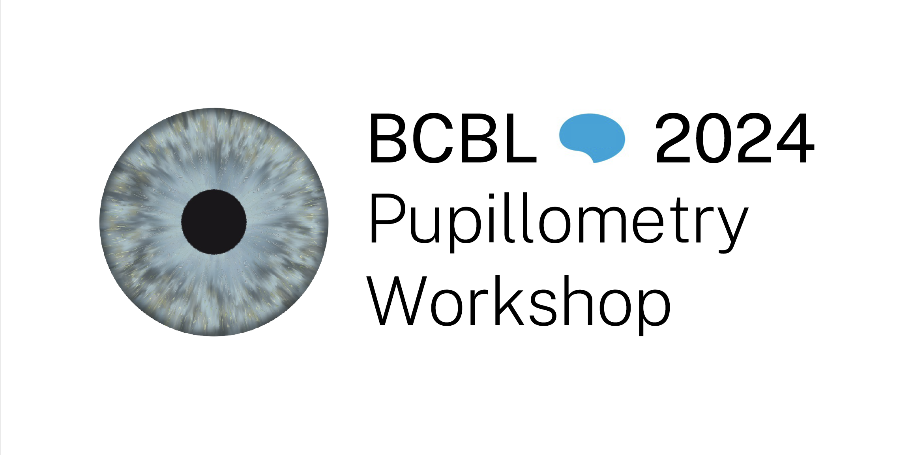

# pupillometry_pipeline
Repository for my most up-to-date pupillometry processing scripts and sample experiments

**Last updated:** May 26, 2024 

**Note:** See BCBL 2024 Workshop Materials (https://drive.google.com/drive/folders/1JI_4mXyyRKmDZk7Ca1-e8hLKNzxxdnyI?usp=drive_link) for original files used at the time of the workshop. This repository is for updated versions of scripts from the workshop.

